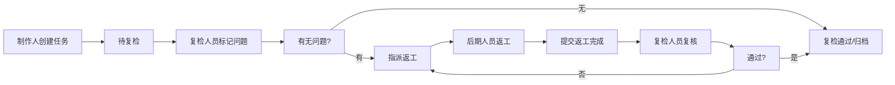
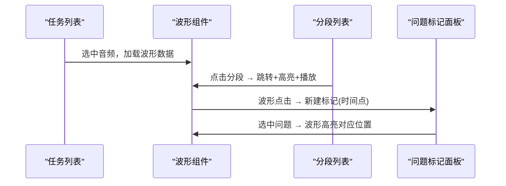

## 1. 产品概述

口播瑕疵批量复检台是面向音频后期制作团队的专业复检工作平台，致力于统一管理音频片段、问题标记、返工状态与复检结论，提升口播内容质检与返工的协作效率。

- 核心目标：将分散的音频质检流程标准化，实现从问题发现→标记分类→返工指派→复检通过的全链路闭环管理
- 目标用户：音频制作人（统筹角色）、质检/复检人员（执行角色）、后期编辑（返工执行角色）
- 产品价值：缩短复检周期、降低漏检率、沉淀问题库与处理记录，实现质检过程可追溯

## 2. 核心功能

### 2.1 用户角色

| 角色 | 说明 | 核心权限 |
|------|------|----------|
| 制作人 | 项目统筹，分配任务 | 全览任务看板、批量筛选、指派返工、导出报告 |
| 复检人员 | 执行质检与复检 | 音频预听、问题标记、复检结论记录、查看历史 |
| 后期编辑 | 执行返工修改 | 查看分配的问题清单、提交返工完成 |

### 2.2 功能模块

1. **任务看板页**：任务列表、多维筛选（状态/角色/优先级/日期）、批量操作、统计概览
2. **复检工作台页**：波形展示、分段预听、问题点标记、问题分类、播放控制
3. **复检详情抽屉**：单条音频的问题时间轴、历史处理记录时间线、返工指派与复检结论
4. **统计面板**：各状态任务数量、问题分类分布、人员效率指标

### 2.3 页面详情

| 页面名称 | 模块名称 | 功能描述 |
|----------|----------|----------|
| 任务看板页 | 顶部统计栏 | 展示待处理/返工中/已完成总数，支持快速筛选切换 |
| 任务看板页 | 筛选工具栏 | 支持按状态、负责人、问题类型、日期范围筛选，关键字搜索 |
| 任务看板页 | 任务列表 | 音频卡片列表，展示封面、时长、状态标签、问题数、负责人，支持排序 |
| 复检工作台页 | 波形展示区 | Canvas绘制音频波形，高亮显示分段和问题标记位置 |
| 复检工作台页 | 播放控制栏 | 播放/暂停、进度条、分段跳转、倍速控制、音量调节 |
| 复检工作台页 | 分段列表 | 音频分段卡片，点击跳转到对应波形位置并预听 |
| 复检工作台页 | 问题标记面板 | 标记新增/编辑/删除，选择问题分类，填写备注，时间点自动填充 |
| 复检工作台页 | 操作按钮区 | 指派返工、提交复检通过、保存草稿 |
| 复检详情抽屉 | 问题时间轴 | 按时间顺序展示该音频所有问题点，可点击跳转试听 |
| 复检详情抽屉 | 历史记录时间线 | 展示从提交→标记→返工→复检的完整处理记录与操作人 |
| 复检详情抽屉 | 指派与结论表单 | 选择返工人员、填写结论、上传返工后音频 |

## 3. 核心流程

### 3.1 复检主流程

制作人上传音频并创建复检任务，复检人员进入工作台对音频进行分段预听，发现问题时在对应时间点添加标记并选择问题分类，标记完成后可指派给后期人员返工；后期人员完成修改后提交，复检人员再次复检确认通过，任务进入归档状态。

### 3.2 前端联动流程

用户在任务列表选中一条音频，波形组件加载对应音频数据并绘制波形；点击分段列表跳转到对应波形区域并自动播放；在波形上点击或拖拽标记问题点，问题列表同步新增记录；点击问题条目反向高亮波形对应位置。

## 4. 用户界面设计

### 4.1 设计风格

- **主色调**：深空蓝 #0F172A 为背景主色，琥珀橙 #F59E0B 为问题警示强调色，翠绿 #10B981 为通过状态色
- **辅助色**：石板灰 #64748B 用于次级文字，蓝紫 #6366F1 用于交互元素（按钮、链接）
- **按钮风格**：微圆角（6px）、2px内阴影按压效果、悬停微放大 + 发光边框
- **字体**：标题用 "Chakra Petch"（科技感等宽字体），正文用 "Noto Sans SC"（清晰中文显示）
- **布局风格**：三栏式主工作台（左列表+中波形+右详情），顶部固定导航 + 状态筛选栏
- **图标风格**：Lucide 线性图标，问题标记用带颜色圆点区分类型
- **视觉特效**：波形区域添加细微网格背景与扫描线动效，卡片悬浮轻微上浮 + 阴影加深

### 4.2 页面设计概览

| 页面名称 | 模块名称 | UI元素 |
|----------|----------|--------|
| 任务看板页 | 统计栏 | 数字卡片带闪烁动画、状态色点指示、趋势小箭头 |
| 任务看板页 | 筛选工具栏 | 胶囊式标签筛选器、下拉选择器、搜索框带放大镜图标 |
| 任务看板页 | 任务列表 | 卡片式布局，封面缩略+波形小预览条、状态徽章悬浮角标 |
| 复检工作台页 | 波形区 | 深色渐变背景+网格、波形青色填充、问题标记彩色竖线悬浮tooltip |
| 复检工作台页 | 播放控制 | 玻璃拟态半透明底栏、大尺寸播放按钮、圆形进度旋钮 |
| 复检工作台页 | 分段/问题面板 | 分组折叠卡片、时间轴垂直线连接、条目标记色块 |
| 复检详情抽屉 | 历史记录 | 垂直时间线设计，节点图标区分操作类型，气泡卡片展示详情 |

### 4.3 响应式设计

- 桌面端（≥1440px）：三栏满布局，波形区占60%宽度
- 平板端（1024-1439px）：左列表可折叠为图标模式，右抽屉改为底部弹出
- 移动端（<1024px）：标签页切换模式（列表/波形/详情三个Tab），触控优化按钮尺寸
- 触控优化：所有交互元素最小44px触控区域，支持双指缩放波形查看细节
