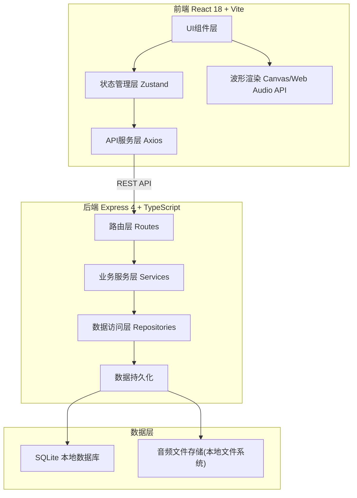
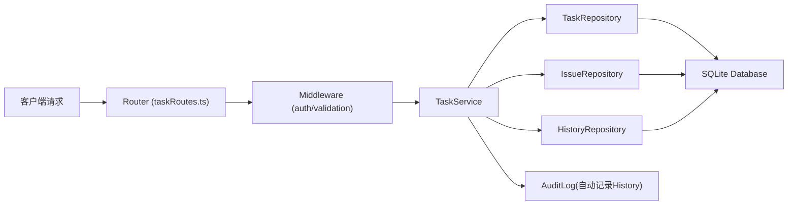
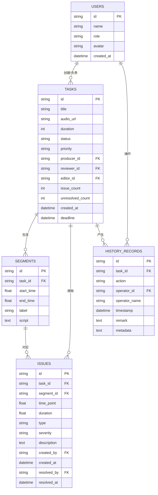

## 1. 架构设计

系统采用前后端分离的分层架构，前端负责波形渲染、交互联动与状态呈现，后端提供任务管理、状态流转与数据持久化能力。



## 2. 技术描述

- **前端**：React@18 + TypeScript + Vite@5
  - 状态管理：Zustand
  - 样式方案：TailwindCSS@3 + CSS变量主题系统
  - 路由：react-router-dom@6
  - 图标库：lucide-react
  - 音频处理：Web Audio API（波形解析）+ HTML5 Audio（播放控制）
  - 波形渲染：原生 Canvas 2D
- **初始化工具**：vite-init（react-express-ts 模板）
- **后端**：Express@4 + TypeScript + ESM
  - 中间件：cors、body-parser、morgan日志
- **数据库**：SQLite（通过 better-sqlite3 驱动，文件型数据库便于单机部署）
- **Mock策略**：开发阶段内置15+条样例音频任务数据，包含多种问题类型与状态

## 3. 路由定义

### 3.1 前端路由

| Route | 页面 | 用途 |
|-------|------|------|
| / | 任务看板页 | 默认首页，展示任务列表与筛选 |
| /workbench/:taskId | 复检工作台页 | 单条音频的复检主工作区 |
| /archive | 归档记录页 | 已完成复检的历史任务查询 |

### 3.2 后端API路由

| 方法 | 路由 | 用途 |
|------|------|------|
| GET | /api/tasks | 获取任务列表（支持筛选查询参数） |
| GET | /api/tasks/:id | 获取单任务详情（含分段、问题、历史） |
| POST | /api/tasks | 创建新任务 |
| PATCH | /api/tasks/:id | 更新任务状态/负责人 |
| GET | /api/tasks/:id/segments | 获取音频分段列表 |
| GET | /api/tasks/:id/issues | 获取问题标记列表 |
| POST | /api/tasks/:id/issues | 新增问题标记 |
| PUT | /api/tasks/:id/issues/:issueId | 编辑问题标记 |
| DELETE | /api/tasks/:id/issues/:issueId | 删除问题标记 |
| POST | /api/tasks/:id/assign | 指派返工（更新负责人+状态） |
| POST | /api/tasks/:id/review | 提交复检结论（通过/返工） |
| GET | /api/tasks/:id/history | 获取历史处理记录 |
| GET | /api/stats/summary | 获取统计概览数据 |
| GET | /api/users | 获取用户列表（用于指派选择） |

## 4. API类型定义

```typescript
// 任务状态枚举
type TaskStatus = 'pending' | 'reviewing' | 'reworking' | 'resubmitted' | 'passed' | 'archived';

// 问题类型枚举
type IssueType = 'stutter' | 'wrong_word' | 'long_pause' | 'noise' | 'breath' | 'tone' | 'other';

// 用户角色
type UserRole = 'producer' | 'reviewer' | 'editor';

interface User {
  id: string;
  name: string;
  role: UserRole;
  avatar?: string;
}

interface AudioSegment {
  id: string;
  taskId: string;
  startTime: number;  // 秒
  endTime: number;
  label: string;       // 分段标签，如"开场白"/"产品介绍"
  script?: string;     // 对应文稿
}

interface IssueMarker {
  id: string;
  taskId: string;
  segmentId?: string;
  timePoint: number;   // 精确到秒
  duration?: number;   // 问题持续时长
  type: IssueType;
  severity: 'low' | 'medium' | 'high';
  description: string;
  createdAt: string;
  createdBy: string;
  resolvedAt?: string;
  resolvedBy?: string;
}

interface HistoryRecord {
  id: string;
  taskId: string;
  action: 'create' | 'mark_issue' | 'assign' | 'submit_rework' | 'review_pass' | 'review_reject' | 'archive';
  operatorId: string;
  operatorName: string;
  timestamp: string;
  remark?: string;
  metadata?: Record<string, any>;
}

interface Task {
  id: string;
  title: string;
  audioUrl: string;
  duration: number;
  status: TaskStatus;
  priority: 'normal' | 'urgent';
  producerId: string;
  producerName: string;
  reviewerId?: string;
  reviewerName?: string;
  editorId?: string;
  editorName?: string;
  issueCount: number;
  unresolvedCount: number;
  createdAt: string;
  deadline?: string;
  segments: AudioSegment[];
  issues: IssueMarker[];
  history: HistoryRecord[];
}
```

## 5. 后端服务架构



分层说明：
- **Router层**：定义HTTP路由与参数校验，处理请求/响应格式
- **Service层**：封装核心业务逻辑，如状态流转校验、指派时同步创建历史记录
- **Repository层**：数据库CRUD封装，屏蔽具体SQL细节
- **横切关注点**：所有写操作自动触发审计日志，写入History表

## 6. 数据模型

### 6.1 ER图



### 6.2 DDL语句

```sql
-- 用户表
CREATE TABLE IF NOT EXISTS users (
  id TEXT PRIMARY KEY,
  name TEXT NOT NULL,
  role TEXT NOT NULL CHECK(role IN ('producer','reviewer','editor')),
  avatar TEXT,
  created_at DATETIME DEFAULT CURRENT_TIMESTAMP
);

-- 任务表
CREATE TABLE IF NOT EXISTS tasks (
  id TEXT PRIMARY KEY,
  title TEXT NOT NULL,
  audio_url TEXT NOT NULL,
  duration INTEGER NOT NULL,
  status TEXT NOT NULL DEFAULT 'pending' CHECK(status IN ('pending','reviewing','reworking','resubmitted','passed','archived')),
  priority TEXT NOT NULL DEFAULT 'normal' CHECK(priority IN ('normal','urgent')),
  producer_id TEXT NOT NULL REFERENCES users(id),
  producer_name TEXT NOT NULL,
  reviewer_id TEXT REFERENCES users(id),
  reviewer_name TEXT,
  editor_id TEXT REFERENCES users(id),
  editor_name TEXT,
  issue_count INTEGER NOT NULL DEFAULT 0,
  unresolved_count INTEGER NOT NULL DEFAULT 0,
  created_at DATETIME NOT NULL DEFAULT CURRENT_TIMESTAMP,
  deadline DATETIME
);

-- 分段表
CREATE TABLE IF NOT EXISTS segments (
  id TEXT PRIMARY KEY,
  task_id TEXT NOT NULL REFERENCES tasks(id) ON DELETE CASCADE,
  start_time REAL NOT NULL,
  end_time REAL NOT NULL,
  label TEXT NOT NULL,
  script TEXT
);

-- 问题表
CREATE TABLE IF NOT EXISTS issues (
  id TEXT PRIMARY KEY,
  task_id TEXT NOT NULL REFERENCES tasks(id) ON DELETE CASCADE,
  segment_id TEXT REFERENCES segments(id) ON DELETE SET NULL,
  time_point REAL NOT NULL,
  duration REAL,
  type TEXT NOT NULL CHECK(type IN ('stutter','wrong_word','long_pause','noise','breath','tone','other')),
  severity TEXT NOT NULL DEFAULT 'medium' CHECK(severity IN ('low','medium','high')),
  description TEXT,
  created_by TEXT NOT NULL REFERENCES users(id),
  created_at DATETIME NOT NULL DEFAULT CURRENT_TIMESTAMP,
  resolved_by TEXT REFERENCES users(id),
  resolved_at DATETIME
);

-- 历史记录表
CREATE TABLE IF NOT EXISTS history_records (
  id TEXT PRIMARY KEY,
  task_id TEXT NOT NULL REFERENCES tasks(id) ON DELETE CASCADE,
  action TEXT NOT NULL,
  operator_id TEXT NOT NULL REFERENCES users(id),
  operator_name TEXT NOT NULL,
  timestamp DATETIME NOT NULL DEFAULT CURRENT_TIMESTAMP,
  remark TEXT,
  metadata TEXT
);

-- 索引
CREATE INDEX IF NOT EXISTS idx_tasks_status ON tasks(status);
CREATE INDEX IF NOT EXISTS idx_tasks_producer ON tasks(producer_id);
CREATE INDEX IF NOT EXISTS idx_tasks_reviewer ON tasks(reviewer_id);
CREATE INDEX IF NOT EXISTS idx_issues_task ON issues(task_id);
CREATE INDEX IF NOT EXISTS idx_history_task ON history_records(task_id);
```

### 6.3 初始Mock数据

应用启动时自动注入以下初始数据：
- **用户**：3个角色各1-2人（制作人"李明"、复检员"王芳/张伟"、编辑"刘静"）
- **任务**：15条音频任务，覆盖所有6种状态，包含不同优先级与时间分布
- **分段**：每条任务4-8个自然分段
- **问题**：每条任务0-8个问题标记，覆盖7种问题类型
- **历史**：每条任务对应2-6条操作历史记录，用于时间线展示
